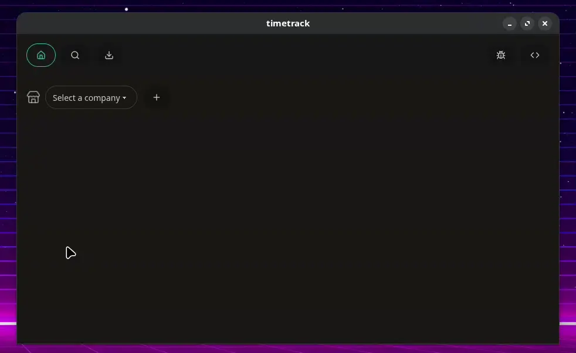

# timetrack

Simple desktop 🖥️ application to track your time ⏰ spent on different projects 🎉.

## Screenshots

### Overview



## Configuration

By default, there is no configuration file.
The application will NOT create one!

If you want to change the default configuration,
you have to create the configuration file yourself.

The configuration file should be located at:

- Linux: `~/.config/timetrack/config.yaml`.
- Mac: `~/Library/Application Support/timetrack/config.yaml`.
- Windows: `%APPDATA%\timetrack\config.yaml`.

> [!NOTE]
> Example configuration file for timetrack:

```yaml
# yaml-language-server: $schema=https://timetrack.mwco.app/config.schema.json
---
databases:
  - marco: /home/marco/Desktop/timetrack.db
  - work: /home/marco/Desktop/timetrack-work.db
```

If no configuration file is present, the default database location is:

- Linux: `~/.local/share/timetrack/timetrack.db`
- Mac: `~/Library/Application Support/timetrack/timetrack.db`
- Windows: `%LOCALAPPDATA%\timetrack\timetrack.db`

## Development

Checkout the [development guide](docs/development.md) for more information.
